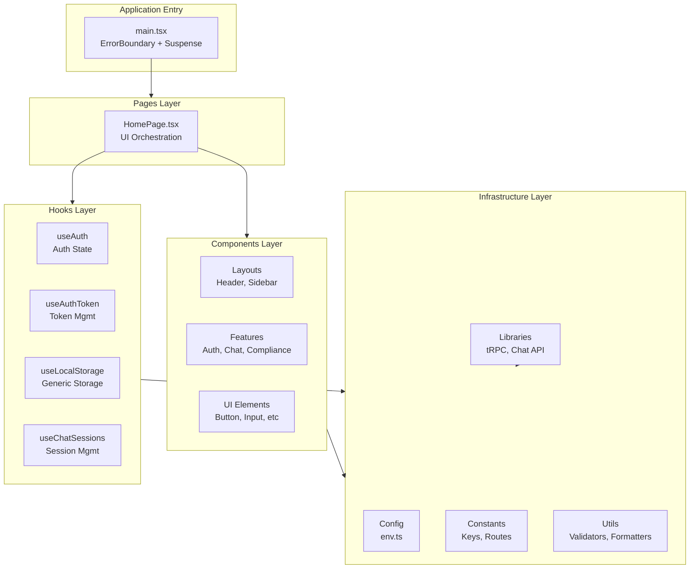
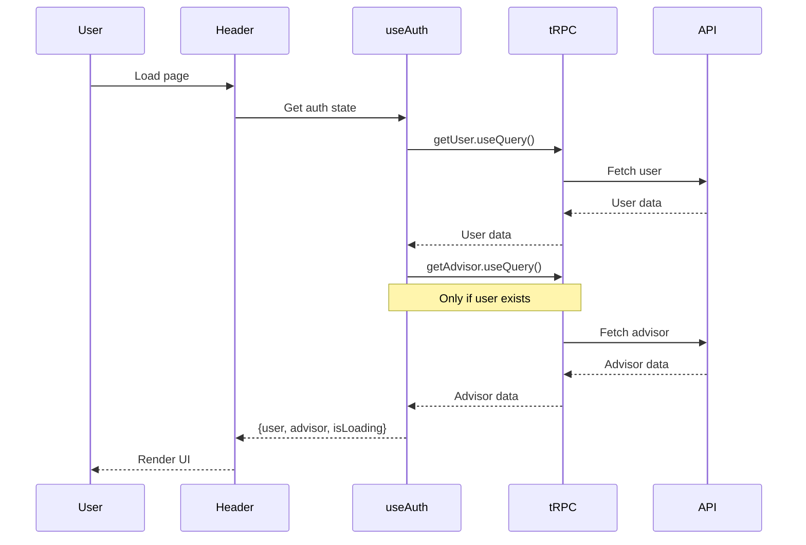
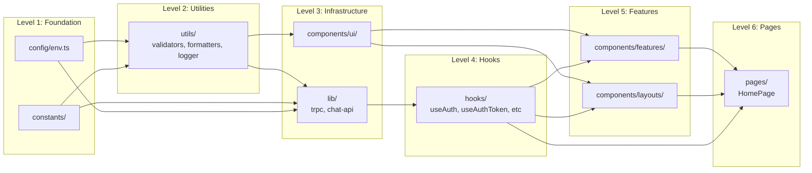
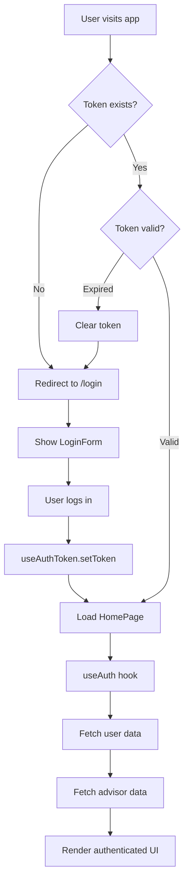

# Application Architecture - After Refactoring

## 🏗️ Architecture Overview



---

## 🔄 Data Flow



---

## 📦 Dependency Hierarchy



---

## 🎨 Component Organization Philosophy

### UI Components (Generic)
**Location:** `components/ui/`  
**Purpose:** Basic, reusable UI elements  
**Examples:** Button, Input, Badge, Avatar  
**Rules:** No business logic, pure presentation

### Feature Components (Domain-Specific)
**Location:** `components/features/{feature}/`  
**Purpose:** Feature-specific logic and UI  
**Examples:** LoginForm, ChatMessage, UserMenu  
**Rules:** Can use hooks, utils, and ui components

### Layout Components (Structure)
**Location:** `components/layouts/`  
**Purpose:** Application structure and layout  
**Examples:** Header, Sidebar, Footer  
**Rules:** Compose features and ui components

---

## 🔐 Authentication Flow



---

## 💾 State Management Strategy

### Local State
- Component-specific state (useState)
- Form inputs
- UI toggles (menu open/closed)

### Derived State (Hooks)
- `useAuth` - Auth state from tRPC
- `useChatSessions` - Session state from localStorage

### Server State (tRPC)
- User data
- Advisor data
- Chat responses

### Persistent State (localStorage)
- Auth token (via useAuthToken)
- Chat sessions (via useLocalStorage)

---

## 🔧 Configuration Strategy

### Environment Variables
```typescript
// config/env.ts
export const env = {
  apiUrl: import.meta.env.VITE_API_URL || 'http://localhost:3001',
  isDev: import.meta.env.DEV,
  isProd: import.meta.env.PROD,
} as const;
```

### Runtime Constants
```typescript
// constants/index.ts
export const STORAGE_KEYS = { /* ... */ } as const;
export const ROUTES = { /* ... */ } as const;
export const API_ENDPOINTS = { /* ... */ } as const;
export const APP_CONFIG = { /* ... */ } as const;
```

---

## 🧪 Testing Strategy (Future)

### Unit Tests
- **Hooks:** `useAuth`, `useAuthToken`, `useLocalStorage`, `useChatSessions`
- **Utils:** `validators`, `formatters`, `logger`
- **Components:** UI components (Button, Input, etc.)

### Integration Tests
- **Features:** LoginForm, ChatInterface, UserMenu
- **Layouts:** Header, Sidebar

### E2E Tests
- **User Flows:** Login → Chat → Logout
- **Error Cases:** Network errors, token expiration

---

## 📊 Performance Considerations

### Current State
- Build size: 565 KB (can be optimized)
- Dev server: Fast HMR
- Type checking: Fast (<2s)

### Future Optimizations
1. Manual chunk splitting (vendor, features)
2. Route-based code splitting
3. Image optimization
4. Bundle analysis

---

## 🎯 Scalability

### Easy to Add New Features
```
components/features/invoices/     ← New feature
  ├── InvoiceList.tsx
  ├── InvoiceDetail.tsx
  └── useInvoiceData.ts           ← Colocated hook

hooks/
  └── useInvoiceSync.ts           ← If reusable across features
```

### Easy to Add New Utilities
```
utils/
  ├── currency.ts                 ← New utility
  └── index.ts                    ← Update barrel export
```

### Easy to Add New Routes
```
routes/
  └── invoices.tsx                ← New route with guard
```

---

## 🔍 Code Review Checklist

When adding new code, check:
- [ ] Using `@/` path aliases?
- [ ] No magic strings? (use constants)
- [ ] No direct localStorage? (use hooks)
- [ ] No `console.log`? (use logger)
- [ ] Proper TypeScript types? (no `any`)
- [ ] Component in right folder? (ui/features/layouts)
- [ ] Hook reusable? (src/hooks/) or specific? (colocated)
- [ ] Error handling? (try/catch + logger)

---

**Status:** Production Ready  
**Maintainability:** High  
**Scalability:** High  
**Code Quality:** Professional
