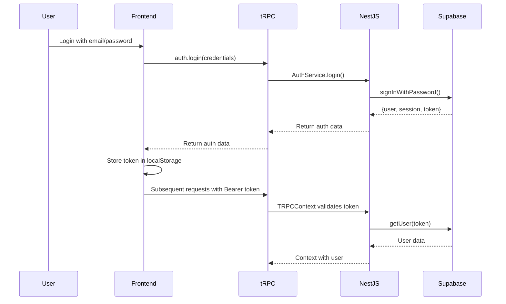

# limetax Atlas Architecture

This document describes the code structure and conventions used in the limetax Atlas project.

## Overview

limetaxIQ is a modern full-stack application providing an AI assistant for German tax advisors (Steuerberater). It uses a monorepo architecture with clear separation between frontend and backend, leveraging best-in-class technologies for type safety and developer experience.

## Tech Stack

- **Monorepo**: Turborepo with pnpm workspaces
- **Backend**: NestJS with tRPC
- **Frontend**: Vite + React + TanStack Router + TanStack Query
- **Shared**: TypeScript types and validators (Zod)
- **Database**: Supabase (PostgreSQL with pgvector)
- **Authentication**: Supabase Auth
- **AI/LLM**: Anthropic Claude Sonnet 4
- **Deployment**: Coolify on AWS

## Monorepo Structure

```
lime-gpt/
├── apps/
│   ├── api/                    # NestJS backend with tRPC
│   │   ├── src/
│   │   │   ├── main.ts        # Bootstrap & tRPC mount
│   │   │   ├── app.module.ts  # Root module
│   │   │   ├── app.router.ts  # Main tRPC router
│   │   │   ├── auth/          # Auth module
│   │   │   ├── chat/          # Chat module
│   │   │   ├── rag/           # RAG module
│   │   │   ├── health/        # Health check
│   │   │   ├── infrastructure/ # External services
│   │   │   └── trpc/          # tRPC configuration
│   │   ├── nest-cli.json
│   │   └── tsconfig.json
│   │
│   └── web/                    # Vite + React frontend
│       ├── src/
│       │   ├── main.tsx       # App entry point
│       │   ├── routes/        # TanStack Router routes
│       │   ├── pages/         # Page components
│       │   ├── views/         # Layout components
│       │   ├── components/    # UI components
│       │   │   ├── elements/  # Pure UI primitives
│       │   │   └── components/ # Business components
│       │   ├── lib/           # Client utilities
│       │   │   ├── trpc.ts    # tRPC client setup
│       │   │   └── query-client.ts
│       │   └── styles/        # Global styles
│       ├── vite.config.ts
│       └── tsconfig.json
│
├── packages/
│   └── shared/                 # Shared types & validators
│       ├── src/
│       │   ├── types/         # Database & app types
│       │   └── utils/         # Validators (Zod)
│       └── tsconfig.json
│
├── database/                   # SQL migrations
│   └── migrations/
├── supabase-project/          # Local Supabase Docker
├── turbo.json                 # Turborepo configuration
├── pnpm-workspace.yaml        # Workspace definition
└── package.json               # Root scripts
```

## Architecture Layers

### Backend Architecture (NestJS)

```
┌─────────────────────────────────────────────────────────┐
│              tRPC Routers (app.router.ts)               │
│         Type-safe API endpoints, input validation       │
├─────────────────────────────────────────────────────────┤
│              NestJS Modules & Services                  │
│         Business logic, orchestration, DI               │
├─────────────────────────────────────────────────────────┤
│            Infrastructure Services (@Global)            │
│      SupabaseService, AnthropicService, etc.            │
└─────────────────────────────────────────────────────────┘
```

| Layer              | Location                       | Responsibility               | Examples                                      |
| ------------------ | ------------------------------ | ---------------------------- | --------------------------------------------- |
| **tRPC Routers**   | `apps/api/src/*/router.ts`     | Type-safe API procedures     | `auth.router.ts`, `chat.router.ts`            |
| **Services**       | `apps/api/src/*/service.ts`    | Business logic orchestration | `auth.service.ts`, `chat.service.ts`          |
| **Infrastructure** | `apps/api/src/infrastructure/` | External service clients     | `supabase.service.ts`, `anthropic.service.ts` |
| **Modules**        | `apps/api/src/*/module.ts`     | NestJS dependency injection  | `auth.module.ts`, `chat.module.ts`            |

#### Key Backend Principles

1. **NestJS Dependency Injection** - All services use constructor injection
2. **Global Infrastructure Module** - External clients available everywhere via `@Global()`
3. **tRPC for Type Safety** - Full end-to-end type safety from backend to frontend
4. **Service Layer Pattern** - Business logic separated from infrastructure
5. **OnModuleInit for Setup** - Infrastructure services initialize on module load

### Frontend Architecture (Vite + React)

```
┌─────────────────────────────────────────────────────────┐
│              Routes (TanStack Router)                   │
│         File-based routing, type-safe navigation        │
├─────────────────────────────────────────────────────────┤
│                 Pages & Views                           │
│         Page composition, layout components             │
├─────────────────────────────────────────────────────────┤
│              Components (Business Logic)                │
│         Reusable UI with state management               │
├─────────────────────────────────────────────────────────┤
│               Elements (Pure UI)                        │
│          Primitive components, no business logic        │
├─────────────────────────────────────────────────────────┤
│              tRPC Client + React Query                  │
│         Type-safe API calls, caching, optimistic UI     │
└─────────────────────────────────────────────────────────┘
```

| Layer          | Location                              | Responsibility            | Examples                           |
| -------------- | ------------------------------------- | ------------------------- | ---------------------------------- |
| **Routes**     | `apps/web/src/routes/`                | Route definitions, guards | `index.tsx`, `login.tsx`           |
| **Pages**      | `apps/web/src/pages/`                 | Page-level components     | `HomePage.tsx`                     |
| **Views**      | `apps/web/src/views/`                 | Layout components         | `ChatInterface.tsx`, `Header.tsx`  |
| **Components** | `apps/web/src/components/components/` | Business components       | `LoginForm.tsx`, `ChatMessage.tsx` |
| **Elements**   | `apps/web/src/components/elements/`   | Pure UI primitives        | `Button.tsx`, `Input.tsx`          |
| **Lib**        | `apps/web/src/lib/`                   | Client utilities          | `trpc.ts`, `query-client.ts`       |

#### Key Frontend Principles

1. **TanStack Router** - File-based routing with type-safe navigation
2. **tRPC React Query** - Type-safe API calls with automatic caching
3. **Component Hierarchy** - Elements → Components → Views → Pages → Routes
4. **Vite for Speed** - Lightning-fast HMR and optimized builds
5. **Path Aliases** - `@/` for clean imports

### Shared Package Architecture

The `@lime-gpt/shared` package provides:

- **Database Types** - Generated from Supabase schema
- **Application Types** - Message, Citation, ChatSession, etc.
- **Validators** - Zod schemas for runtime validation
- **Type Safety** - Shared between frontend and backend

## Type Safety Flow

```mermaid
graph LR
    Database[Supabase Schema] --> SharedTypes[@lime-gpt/shared]
    SharedTypes --> Backend[NestJS Services]
    Backend --> tRPCRouter[tRPC Router]
    tRPCRouter --> AppRouterType[AppRouterType Export]
    AppRouterType --> Frontend[React Components]
    Frontend --> tRPCClient[tRPC Client]
    tRPCClient --> ReactQuery[React Query]
```

**End-to-end type safety:**

1. Database schema → TypeScript types in `@lime-gpt/shared`
2. NestJS services use shared types
3. tRPC routers export `AppRouterType`
4. Frontend imports `AppRouterType` for full autocomplete
5. React Query provides caching and optimistic updates

## Data Model

### Multi-Tenant Structure

```
Advisory (Kanzlei)
├── Advisors (Steuerberater/Mitarbeiter) → auth.users
└── Clients (Mandanten) → auth.users (future)
```

### Tables

| Table           | Description                    | Auth Link       |
| --------------- | ------------------------------ | --------------- |
| `advisories`    | Tax advisory firms (Kanzleien) | -               |
| `advisors`      | Staff members                  | `auth.users.id` |
| `tax_documents` | RAG knowledge base             | -               |
| `datev_clients` | DATEV client data              | -               |
| `datev_orders`  | DATEV order data               | -               |

### Vector Search Functions

| Function              | Purpose                 | Returns                   |
| --------------------- | ----------------------- | ------------------------- |
| `match_tax_documents` | Semantic search in laws | Documents with similarity |
| `match_datev_clients` | Find clients by query   | Clients with similarity   |
| `match_datev_orders`  | Find orders by query    | Orders with similarity    |

## Design System

The design system is implemented via:

- Tailwind CSS 4.0 with Vite plugin
- CSS variables in `globals.css`
- Component variants in elements

### Key Colors

| Name           | Value     | Usage                 |
| -------------- | --------- | --------------------- |
| Primary Orange | `#F2B76C` | CTAs, highlights      |
| Accent Lime    | `#84cc16` | Focus states, accents |
| Gray-900       | `#111827` | Dark backgrounds      |
| Background     | `#FFFAFA` | Page background       |

### Typography

- **Font Family**: Inter (sans-serif)
- **Mono Font**: SF Mono, Monaco

## Authentication Flow



1. User submits login form
2. Frontend calls `trpc.auth.login.mutate()`
3. Backend validates credentials via Supabase
4. Token stored in `localStorage`
5. Subsequent requests include `Authorization: Bearer <token>` header
6. tRPC context provider validates token on each request

## Environment Variables

### Backend (`apps/api/.env`)

| Variable                    | Description               | Required |
| --------------------------- | ------------------------- | -------- |
| `SUPABASE_URL`              | Supabase instance URL     | Yes      |
| `SUPABASE_SERVICE_ROLE_KEY` | Supabase service role key | Yes      |
| `ANTHROPIC_API_KEY`         | Claude API key            | Yes      |
| `FRONTEND_URL`              | Frontend URL for CORS     | Yes      |
| `PORT`                      | API server port           | No       |

### Frontend (`apps/web/.env`)

| Variable       | Description     | Required |
| -------------- | --------------- | -------- |
| `VITE_API_URL` | Backend API URL | Yes      |

## Development Workflow

### Starting Development

```bash
# Install dependencies
pnpm install

# Start all services (recommended)
pnpm dev

# Or start individually
pnpm --filter @lime-gpt/api dev     # Backend on :3001
pnpm --filter @lime-gpt/web dev     # Frontend on :5173
```

### Building for Production

```bash
# Build all packages
pnpm build

# Build specific package
pnpm --filter @lime-gpt/api build
pnpm --filter @lime-gpt/web build
```

### Turborepo Task Pipeline

Tasks defined in `turbo.json`:

- **build**: Builds with dependency chain (`^build`)
- **dev**: Runs dev servers (persistent, no cache)
- **lint**: Lints with dependency chain
- **typecheck**: Type checks with dependency chain
- **test**: Runs tests after build

## Conventions

### Naming

- **Files**: `kebab-case.ts` for utilities, `PascalCase.tsx` for components
- **Components**: PascalCase (`LoginForm`, `ChatMessage`)
- **Functions**: camelCase (`handleSubmit`, `getUser`)
- **Constants**: SCREAMING_SNAKE_CASE (`SYSTEM_PROMPT`)
- **Types**: PascalCase (`Message`, `ChatSession`)
- **NestJS Services**: PascalCase with `Service` suffix (`AuthService`)
- **NestJS Modules**: PascalCase with `Module` suffix (`AuthModule`)

### Imports

**Backend (NestJS):**

```typescript
// 1. External packages
import { Injectable, Logger } from '@nestjs/common';
import { createClient } from '@supabase/supabase-js';

// 2. Internal absolute imports
import { SupabaseService } from '../infrastructure/supabase.service';

// 3. Shared package imports
import type { Message, Database } from '@lime-gpt/shared';
```

**Frontend (React):**

```typescript
// 1. External packages
import React from 'react';
import { createFileRoute } from '@tanstack/react-router';

// 2. Internal absolute imports
import { Button } from '@/components/elements/Button';
import { trpc } from '@/lib/trpc';

// 3. Shared package imports
import type { Message } from '@lime-gpt/shared';
```

### NestJS Service Structure

```typescript
import { Injectable, Logger } from '@nestjs/common';

@Injectable()
export class AuthService {
  private readonly logger = new Logger(AuthService.name);

  constructor(private readonly supabase: SupabaseService) {}

  async login(email: string, password: string) {
    // Implementation
  }
}
```

### React Component Structure

```typescript
// 1. Imports
import React from 'react';

// 2. Types/Interfaces
interface ButtonProps {
  variant?: 'primary' | 'secondary';
  children: React.ReactNode;
}

// 3. Component
export const Button: React.FC<ButtonProps> = ({
  variant = 'primary',
  children,
}) => {
  // Hooks first
  const [state, setState] = useState();

  // Event handlers
  const handleClick = () => {};

  // Render
  return <button>{children}</button>;
};
```

### tRPC Router Structure

```typescript
import { Injectable } from '@nestjs/common';
import { router, publicProcedure, protectedProcedure } from '../trpc/trpc.service';
import { z } from 'zod';

@Injectable()
export class AuthRouter {
  constructor(private readonly authService: AuthService) {}

  createRouter() {
    return router({
      login: publicProcedure
        .input(z.object({ email: z.string(), password: z.string() }))
        .mutation(async ({ input }) => {
          return await this.authService.login(input.email, input.password);
        }),
    });
  }
}
```

## Testing

- **Unit tests**: Services and utilities
- **Integration tests**: tRPC procedures
- **E2E tests**: Critical user flows (login, chat)
- **Browser testing**: Live validation with browser tools

## Deployment

- **Platform**: Coolify on AWS
- **Build**: Nixpacks or Docker
- **Database**: Self-hosted Supabase at `supabase.limetax.de`
- **Backend**: `api.limetax.de` (NestJS)
- **Frontend**: `app.limetax.de` (Vite static build)

### Deployment Architecture

```
┌─────────────────┐
│   Cloudflare    │ (DNS & CDN)
└────────┬────────┘
         │
    ┌────┴────┐
    │         │
┌───▼──┐  ┌──▼───┐
│ Vite │  │NestJS│
│ SPA  │  │ API  │
└──────┘  └───┬──┘
              │
         ┌────▼────┐
         │Supabase │
         │PostgreSQL│
         └─────────┘
```

## Migration Notes

This project was migrated from Next.js to NestJS + Vite + Turborepo:

- **Before**: Next.js monolithic app with API routes
- **After**: Separated backend (NestJS) and frontend (Vite)
- **Benefits**:
  - Better separation of concerns
  - Faster frontend builds with Vite
  - Improved type safety with tRPC
  - Better DX with Turborepo caching
  - Independent deployment of frontend/backend

The legacy Next.js code is preserved in the `nextjs/` folder for reference.
